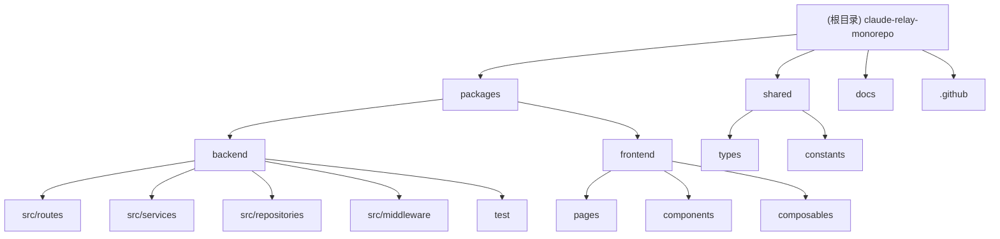

# CLAUDE.md

此文件为 Claude Code 在此代码仓库中工作时提供指导。

## 变更日志 (Changelog)

### 2025-10-13 - AI 上下文初始化
- 初始化项目 AI 上下文
- 创建 `.claude/index.json` 索引文件
- 更新根目录和模块级 CLAUDE.md
- 添加模块结构图和导航面包屑

---

## 项目愿景

Claude Relay 是一个现代化的 Claude API 代理服务，旨在为开发者提供：
- **统一接口**: 兼容官方 Claude API，支持无缝切换第三方 LLM 供应商
- **企业级可靠性**: Key Pool 管理、智能轮换、故障恢复
- **全球化部署**: 基于 Cloudflare Workers 边缘网络，超低延迟
- **可视化管理**: 现代化 Web 界面，一站式管理所有配置

## 架构概览

这是一个 Cloudflare 全栈应用的 **monorepo**，采用前后端统一部署架构。

### 技术栈
- **前端**: Nuxt 4, Vue 3, Tailwind CSS
- **后端**: Hono, TypeScript, Bun 运行时
- **部署**: Cloudflare Workers (统一部署架构，前后端合并)
- **存储**: Cloudflare KV
- **测试**: Vitest (专注集成测试)
- **静态资源**: Workers Assets (前端构建产物)

### 项目结构
```
├── packages/
│   ├── frontend/          # Nuxt 4 + Vue 3 + Tailwind CSS
│   └── backend/           # Hono + Cloudflare Workers
│       ├── src/           # 源代码
│       └── test/          # 集成测试
├── shared/                # 共享 TypeScript 类型和常量
├── docs/                  # 项目文档
│   ├── deployment.md      # 部署指南
│   ├── development.md     # 开发指南
│   ├── api.md            # API 文档
│   └── images/           # 项目截图和演示 GIF
└── .github/workflows/     # GitHub Actions 配置
```

## 模块结构图



## 模块索引

| 模块 | 路径 | 技术栈 | 职责 |
|------|------|--------|------|
| **Backend** | [packages/backend](./packages/backend/CLAUDE.md) | Hono + Cloudflare Workers | Claude API 代理、管理 API、Key Pool 管理、供应商管理 |
| **Frontend** | [packages/frontend](./packages/frontend/CLAUDE.md) | Nuxt 4 + Vue 3 | 可视化管理中心，Claude 账号、供应商、模型选择界面 |
| **Shared** | [shared](./shared/CLAUDE.md) | TypeScript | 前后端共享类型定义和常量 |

## 运行和开发

### 核心命令
- `npm run dev:frontend` - 启动 Nuxt 前端开发服务器 (localhost:3000)
- `npm run dev:backend` - 使用 Bun 启动后端开发服务器 (localhost:8787)
- `npm run build:all` - 构建前后端
- `npm run deploy:all` - 统一部署到 Cloudflare Workers
- `npm run test:backend` - 运行集成测试 (Vitest)
- `npm run lint` - 代码检查
- `npm run type-check` - TypeScript 类型检查

### 后端开发模式
1. **Bun 模式 (推荐)**: `npm run dev:backend` - 快速开发，本地 KV 存储
2. **Wrangler 模式**: `npm run dev:backend:wrangler` - 生产环境模拟

### 前端开发模式
- 开发环境自动连接本地后端 API (localhost:8787)
- 生产环境连接部署的后端 API

### 访问方式

#### 开发环境
- 前端: `http://localhost:3000/admin`
- 后端: `http://localhost:8787`

#### 生产环境
- **统一访问地址**: `https://claude-relay-unified.{你的子域名}.workers.dev`
- **管理中心**: `https://claude-relay-unified.{你的子域名}.workers.dev/admin`
- **API 端点**: `https://claude-relay-unified.{你的子域名}.workers.dev/v1/messages`

## 测试策略

- **集成测试优先**: 专注于 API 端点和完整功能验证
- **测试文件**: 如 `claude-proxy.gemini.test.ts` 进行自动化验证
- **测试命令**:
  - `npm run test:backend` - 运行所有集成测试
  - `npm run test:backend:ui` - 启动 Vitest UI 界面
  - `npm run test:backend:watch` - 文件变化时自动运行测试
- **测试设置**: `packages/backend/test/setup.ts` 配置测试环境和本地 KV

## 编码规范

### 分层架构
- **路由层 (Routes)**: 处理 HTTP 请求，参数验证，调用服务层
- **服务层 (Services)**: 业务逻辑，协调多个 Repository
- **存储层 (Repositories)**: 数据访问，操作 KV 存储

### 类型安全
- **全链路 TypeScript**: 前后端全部使用 TypeScript
- **共享类型**: 所有 API 接口类型定义在 `shared/types` 中
- **严格模式**: 启用 TypeScript strict 模式

### 模块化设计
- **按功能域组织**: admin、proxy、key-pool、transformers
- **单一职责**: 每个模块/类只负责一个功能域
- **依赖注入**: 通过构造函数注入依赖（如 KV namespace）

### 错误处理
- **自定义错误类**: `AppError`, `ValidationError`, `NotFoundError`
- **全局错误处理**: `app.onError` 统一处理所有异常
- **用户友好**: 返回清晰的错误信息，包含 timestamp

## AI 使用指南

### Claude Code 配置

在 Claude Code 配置中使用本项目作为 API 代理：

```json
{
  "env": {
    "ANTHROPIC_API_KEY": "any",
    "ANTHROPIC_BASE_URL": "https://your-domain.workers.dev"
  }
}
```

### 智能路由

本项目支持智能路由功能：
1. 在管理中心配置供应商和模型映射
2. 创建路由配置，设置模型映射关系
3. 选择路由配置后，所有请求自动路由到对应的供应商

### 支持的供应商

- **官方 Claude**: 支持所有 Claude 模型
- **Google Gemini**: 支持 gemini-pro、gemini-pro-vision 等
- **魔搭 Qwen**: 支持 qwen-turbo、qwen-plus、qwen-max 等
- **智谱 AI**: 支持 glm-4、glm-4-plus 等

## 核心功能

### Claude Relay 后端
- **智能代理**: 自动路由请求到官方 Claude API 或第三方 LLM 供应商
- **多格式转换**: 支持 Claude-OpenAI、Claude-Gemini 格式转换
- **Key Pool 管理**: 企业级 API 密钥池管理，支持智能轮换和故障恢复
- **供应商管理**: 支持魔搭 Qwen、智谱 AI、Google Gemini 等多个供应商
- **统一错误处理**: 全局异常捕获和标准化错误响应

### 管理中心前端
- **Claude 账号管理**: OAuth 认证，Token 自动刷新
- **供应商配置**: 添加、编辑第三方 AI 模型供应商
- **模型选择**: 在官方 Claude 和第三方模型间切换
- **Key Pool 界面**: 批量导入、状态管理、统计监控

## API 端点

### Claude API 代理
- `POST /v1/messages` - 智能代理 Claude API，支持官方和第三方供应商路由
- `GET /v1/health` - 服务健康检查

### 管理中心 API
- `POST /api/admin/auth` - 管理员认证
- `GET /api/admin/dashboard` - 仪表板数据
- `GET/POST/PUT/DELETE /api/admin/providers` - 供应商管理
- `GET/POST /api/admin/models` - 模型管理
- `GET/POST/DELETE /api/admin/claude-accounts` - Claude 账号管理

### Key Pool 管理 API
- `GET /api/admin/key-pool/:providerId` - 获取密钥池状态
- `POST /api/admin/key-pool/:providerId/keys` - 添加密钥
- `POST /api/admin/key-pool/:providerId/keys/batch` - 批量添加密钥
- `POST /api/admin/key-pool/:providerId/keys/batch-operation` - 批量操作

## 环境配置

### 后端环境变量
```bash
# 通过 Cloudflare Dashboard 设置
ADMIN_USERNAME=your_admin_username
ADMIN_PASSWORD=your_secure_password
CLAUDE_CLIENT_ID=your_client_id      # 可选
CLAUDE_CLIENT_SECRET=your_client_secret  # 可选
```

### KV 绑定
- `CLAUDE_RELAY_ADMIN_KV` - 存储所有管理数据和配置

## 部署流程

### 统一部署架构
项目采用 **Cloudflare Workers + Assets** 统一部署架构：
- 前端构建产物通过 Workers Assets 提供静态文件服务
- 后端 Hono 应用处理 API 请求
- 单个 Worker 同时处理前后端请求，简化部署和维护

### 部署命令
1. `npm run deploy:all` - 自动化完整部署（推荐）
2. `npm run deploy:backend` - 仅部署后端
3. `npm run deploy:frontend` - 仅部署前端（通常不需要单独执行）

### 部署配置
通过 GitHub Actions 自动部署，配置文件：`.github/workflows/deploy.yml`

详细部署指南请参考：[docs/deployment.md](./docs/deployment.md)
